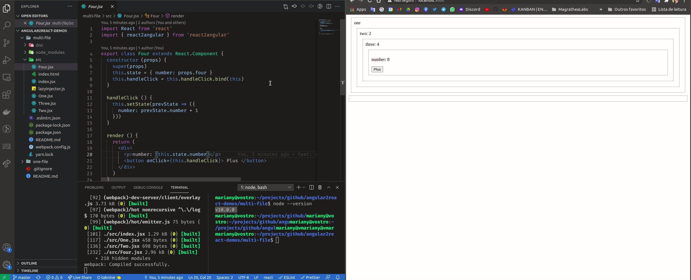

# angular2react-demos

> Example usages for [angular2react](https://github.com/coatue-oss/angular2react)

## Examples

- [One file with multiple nested components (React root component)](one-file)
- [Multi file with multiple nested components (React root component)](multi-file)

## Requirements

- Node 10.6.0 or minor version

## License

MIT
